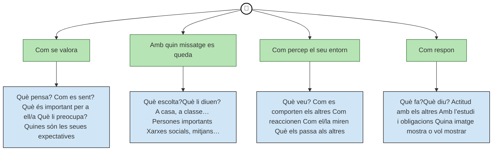
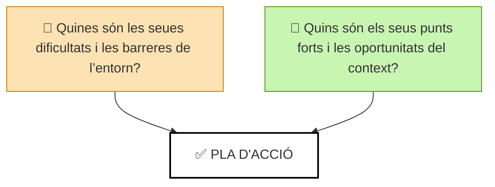

# **Atenció a la diversitat** *(MREI – Mesures de Resposta Educativa a la Inclusió)*

Aquesta Situació d’Aprenentatge es dissenya des del principi amb una mirada inclusiva, partint del **Disseny Universal per a l’Aprenentatge (DUA)** i aplicant **Mesures de Resposta Educativa a la Inclusió (MREI)** per tal d’atendre la diversitat d’estils, ritmes i necessitats educatives que presenta l’alumnat del cicle.

## 🎯 Objectiu de les MREI
Assegurar que **tots els alumnes**, independentment de les seues capacitats, dificultats o contextos, puguen accedir, participar i progressar en la Situació d’Aprenentatge amb garanties.

Es tracta, sobretot, de garantir que **cada alumne tinga el seu temps** i **les condicions adequades per arribar als resultats d’aprenentatge**, al seu ritme i segons les seues possibilitats, però sempre amb l’ambició d’aconseguir-los.

## 🧭 Comprendre per a incloure: el mapa d’empatia

Per aplicar amb sentit les MREI, primer cal fer l’esforç d’entendre **com viu, sent i percep** cada alumne o alumna la realitat educativa. El **mapa d’empatia** ens ajuda a posar-nos en la seua pell i detectar quines barreres, fortaleses i suports necessita.

*Mapa d'empatia adaptat per l’IES Jaume II el Just a partir de la versió original de Javier Agustí i Màbel Villascusa (XPLANE). Llicència Creative Commons CC BY-NC-SA.*

Un vegada hem observat i analitzat les necessitats de cada alumne/a, el següent pas és traçar un **pla d’acció** que tinga en compte tant les seues dificultats com les seues fortaleses.

*DAFO adaptat per l’IES Jaume II el Just a partir de la versió original de Javier Agustí i Màbel Villascusa (XPLANE). Llicència Creative Commons CC BY-NC-SA.*

## 🧩 Mesures aplicades

- **Flexibilització de l’accés al contingut**
    - Materials multimodals (vídeos, esquemes visuals, tutorials, demostracions en viu).
    - Adaptació del nivell de complexitat dels recursos segons les necessitats de cada alumne/a.

- **Diversificació de les activitats**
    - Tasques amb diferents graus de dificultat, però amb el mateix objectiu.
    - Possibilitat de triar entre diverses formes d’evidenciar l’aprenentatge (muntatge físic, simulació, presentació oral...).

- **Suport personalitzat**
    - Acompanyament més intensiu per a l’alumnat amb NESE o amb dificultats puntuals.
    - Sessions de reforç i tutories específiques dins o fora de l’horari habitual.

- **Organització cooperativa**
    - Rols dins dels grups adaptats a les fortaleses individuals.
    - Dinàmiques que fomenten l’ajuda mútua i el suport entre iguals.

- **Avaluació adaptada**
    - Instruments variats i personalitzats: observació directa, autoavaluació, coavaluació, presentació oral...
    - Valoració del procés, no sols del producte final.

> 💬 *L’aula es concep com un espai segur, acollidor i transformador, on cada alumne/a troba el seu lloc, el seu ritme i la seua manera d’aprendre. No es tracta de fer tots el mateix, sinó de garantir que tots puguen arribar, cadascú des d’on està, amb el seu temps i amb sentit.*

